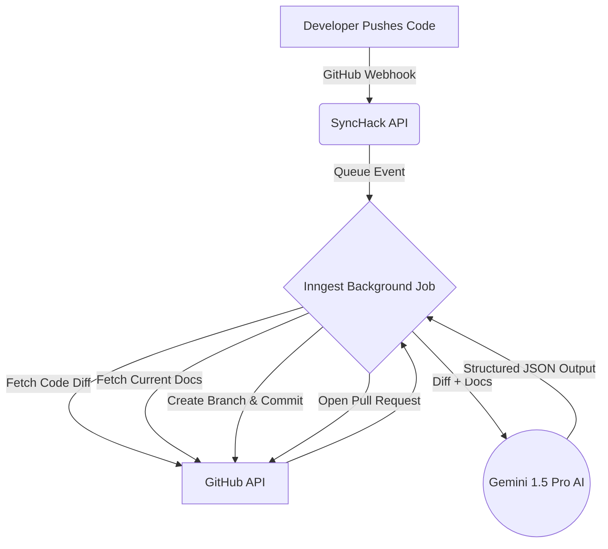

# 🚀 SyncHack Core: End-to-End Product Vision & Architecture

> [!NOTE]
> SyncHack Core is a completely automated background pipeline that acts like a CI/CD system for documentation. It solves the eternal problem of stale, out-of-date `README`s and markdown files by detecting code changes and rewriting documentation on the fly.

## 🎯 The Problem & The Solution

**The Problem:** Documentation goes out of date the moment code is pushed. Developers either forget to update the docs, lack the time, or find the context-switching tedious. Existing solutions (like linters) just complain that docs are missing, but they don't actually do the work.

**The Solution:** SyncHack uses modern Large Language Models (Google Gemini 1.5 Pro) with massive context windows to read your code diffs, read your existing documentation, and intelligently rewrite the documentation to match the new code. It does this automatically in the background via GitHub Webhooks.

## 👥 Who is this for?

* **Software Engineers:** Who want to push code and move on to the next feature without writing boilerplate docs.
* **Open Source Maintainers:** Who struggle to keep project READMEs updated with rapidly merging PRs.
* **Engineering Teams:** Who want a single source of truth that is never out of sync with the actual codebase.

---

## 🏗️ How It Works (The User Journey)

### 1. Onboarding & Setup
1. A developer visits the SyncHack landing page and clicks **Login with GitHub**.
2. They are taken to a beautiful **Dashboard** where they can see all their GitHub repositories.
3. They click **Install App**, which redirects them to GitHub to grant SyncHack permissions to specific repositories.
4. Back in the dashboard, they configure their repository settings:
   - **Docs Path**: Which folder holds their markdown files (e.g., `/docs` or `/readme.md`).
   - **Update Mode**: Whether SyncHack should open a **Pull Request (Recommended)** or **Commit Directly** to the main branch.

### 2. The Magic (Background Sync Flow)
1. **The Trigger:** The developer pushes code to their repository's `main` branch.
2. **The Webhook:** GitHub instantly pings the SyncHack API.
3. **The Queue:** To avoid server timeouts, SyncHack immediately queues a background job using **Inngest**.
4. **Context Gathering:** The background job fetches the exact code diff (what changed) and the raw contents of the current documentation files.
5. **AI Analysis:** The diff and the docs are sent to **Gemini 1.5 Pro**. The AI is strictly instructed to return a JSON object detailing exactly which documentation files need to change and what the new markdown should be.
6. **The Action:** 
   - If the AI says no changes are needed, the job silently completes.
   - If changes are needed, SyncHack creates a new branch on GitHub, commits the new documentation, and opens a beautiful Pull Request for the developer to review.

---

## 🛠️ Tech Stack & Architecture

SyncHack is built on a modern, robust, and scalable edge-ready tech stack.

* **Frontend & API:** Next.js 14 (App Router) with Tailwind CSS and Shadcn UI.
* **Database:** PostgreSQL managed via Prisma ORM.
* **Authentication:** NextAuth.js (Auth.js v5 Beta) for seamless GitHub OAuth integration.
* **Background Processing:** Inngest (Serverless event-driven queues to handle long-running LLM tasks).
* **AI Engine:** Google Gemini 1.5 Pro (Chosen for its massive context window, capable of reading entire repository diffs).
* **Integrations:** GitHub App API (Octokit) for branch creation, committing, and PR management.

````carousel

<!-- slide -->
### Database Schema Overview
- **User:** Stores developer profiles from GitHub OAuth.
- **Repository:** Stores configuration per repo (Installation IDs, Docs Path, Update Mode).
- **SyncLog:** Acts as the source of truth for observability. Tracks every webhook push, linking to the commit SHA, and storing the final status (`PENDING`, `PROCESSING`, `SUCCESS`, `NO_CHANGES`, or `FAILED`).
````

---

## 🛡️ Edge Cases & Safety Mechanisms

SyncHack is designed to be a silent helper, not a noisy annoyance.

> [!IMPORTANT]
> **Infinite Loop Prevention:** SyncHack explicitly ignores webhooks triggered by its own bot commits.
> 
> **Branch Filtering:** SyncHack only triggers on pushes to the repository's `default_branch` (usually `main` or `master`). It ignores feature branches to save API costs and reduce spam.
>
> **Strict JSON Schemas:** Gemini is heavily restricted using JSON Schema enforcement (`response_mime_type: "application/json"`). This prevents the AI from hallucinating conversational text and ensures it only outputs actionable file paths and markdown content.

## 🌟 The Future (Post-MVP)

While the current version focuses strictly on automating documentation updates when code changes, the future architecture supports **bi-directional sync**. In the future, a developer could edit a markdown file to document a new API endpoint, and SyncHack could automatically scaffold the underlying code for that endpoint in a Pull Request.
