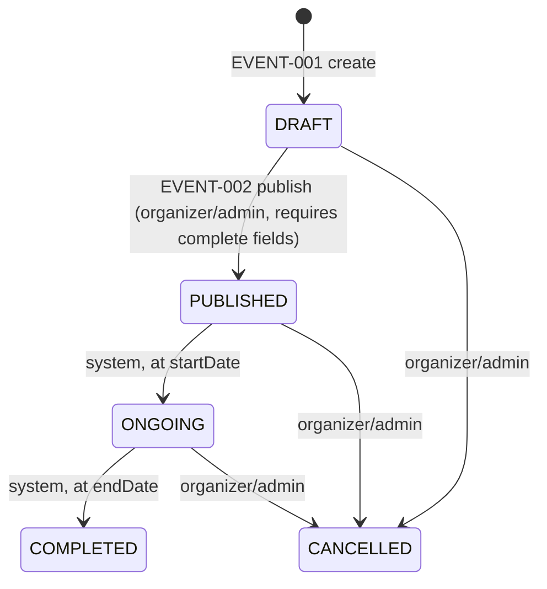
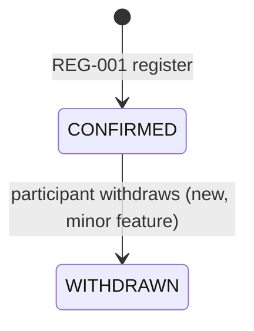
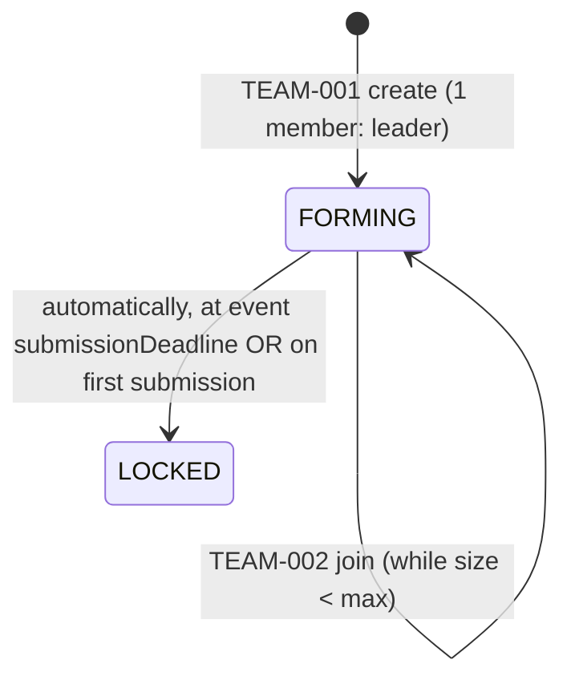
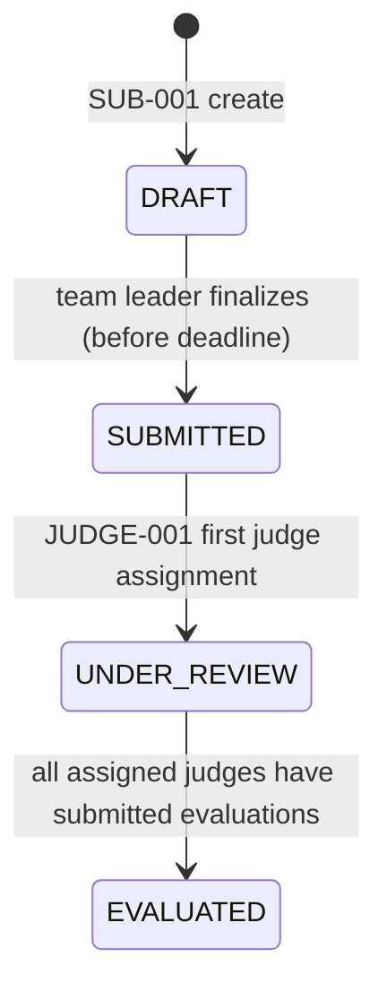
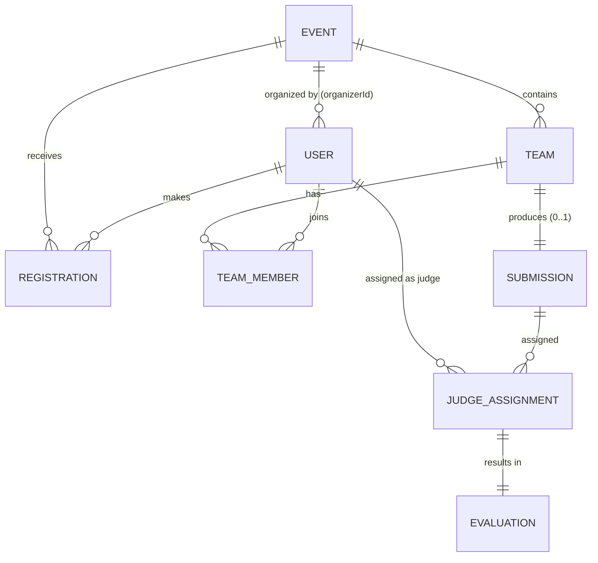
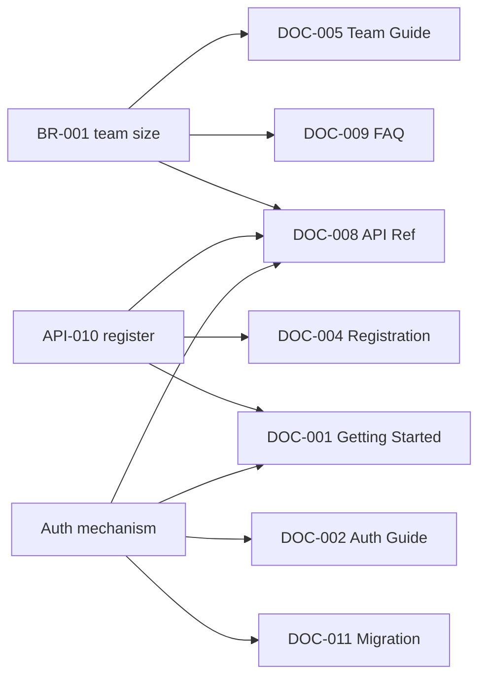

# SyncFlow
## Product Requirements Document — v2.0 (Refined)

**Document Version:** 2.0
**Supersedes:** v1.0 (draft)
**Product Version:** 0.1.0 (target)
**Status:** Ready for Architecture Phase
**Purpose:** SYNC HACK — Track 1
**Primary Objective:** Build a real product whose documented behavior can drift from its actual behavior, then use Thally to detect the drift and produce reviewable documentation updates.

---

## 0. Research Findings & Verification Status

Per the instruction to research before rewriting, here is what was verified and what was not, as of 2026-08-21.

### 0.1 SYNC HACK / Track 1 — **NOT FOUND**

No public, indexable source for an event called "SYNC HACK" with a "Track 1" documentation-synchronization challenge could be located. Several unrelated "Sync Hack" / "Syncs Hack" student hackathons exist (University of Sydney's annual event, various "Hack the Track" logistics hackathons) but none reference Thally or documentation synchronization.

**Consequence:** every "official requirement" implied by the original PRD (judging criteria, exact deliverable format, submission mechanics, restrictions on tooling, whether a live demo vs. a video is required, team size limits, time limits) is **ASSUMPTION — VERIFY BEFORE IMPLEMENTATION**. This document proceeds on the reasonable inferred goal stated in the original draft — *demonstrate that product changes can be traced to affected documentation and converted into reviewable documentation updates* — but you should get the actual rules doc from the organizers (Discord, email, info pack) and reconcile it against Sections 33–39 before build starts. If you have that brief, share it and this document can be corrected in one pass rather than guessed at repeatedly.

### 0.2 Thally — Verified from official docs (docs.thally.app)

Confirmed capabilities, in Thally's own words:

| Capability | What it actually does | Source confidence |
|---|---|---|
| Docs-as-code publishing | Pages, navigation, OpenAPI files, and versioned settings live in Git; Thally publishes them (managed hosting at a `thally.app` address, or self-hosted open-source) | High — official docs |
| Multi-format serving | Same structured content is served as HTML, Markdown, JSON, JSON-LD, plus search, embeddings, and agent endpoints | High — official docs |
| **Track** (the change-sync feature) | Traces product changes to specific evidence, confirms which pages are affected, and can prepare a **documentation pull request** when a merged product change affects docs | High — official docs, but only landing-page depth. **Exact trigger mechanism (webhook? poll? which repos? what counts as "evidence"?) is not yet confirmed — ASSUMPTION** |
| OpenAPI → docs | Turns an OpenAPI spec into interactive endpoint pages | High |
| Pre-deploy checks | Catches content/config errors before deploying docs | High |
| Cloud-only add-ons | "Product Knowledge," analytics, and grounded AI answers are listed as cloud-service extras beyond the open-source core | Medium — named but not detailed on the landing page |

**Not verified / must confirm before architecture:**
- Whether Track watches a *separate* application repo, or only the docs repo itself (i.e., does Thally need read access to `apps/api` and `apps/web`, or does it only reconcile docs against an OpenAPI file you regenerate and push?).
- What "evidence" means concretely — commit diffs? PR descriptions? OpenAPI diffs? test changes?
- Whether Track can be triggered on-demand (needed for a live demo) or only on merge-to-main (which would make the demo require pre-staged commits).
- Rate limits, auth model (GitHub App? PAT?), and whether self-hosted vs. managed changes any of the above.

Recommendation: before Phase 4 (Section 21 below), spend a fixed timebox (recommend ≤2 hours) doing a spike — connect a throwaway repo to Thally, make one trivial change, and observe exactly what Track produces. Everything in Section 15 (Thally Strategy) below is written to be **falsifiable by that spike** rather than assumed permanent.

### 0.3 Distinguishing official / inferred / recommended throughout this document

Every requirement below is implicitly one of:
- **[OFFICIAL]** — stated by the hackathon (currently: none found, so nothing in this document carries this tag with confidence)
- **[INFERRED]** — a reasonable reading of the stated Track 1 objective, carried over from the original draft
- **[RECOMMENDATION]** — this document's own addition, justified by hackathon-demo strength or engineering realism

Where a tag is omitted, treat it as **[RECOMMENDATION]**.

---

## A. Critical Issues Found in Original PRD (summary — see full list in Section 24)

Before the expanded content, the headline problems with v1.0, so you can see what changed and why:

1. **No verification that "SYNC HACK Track 1" is real or that its requirements were correctly captured.** v1.0 stated things like team-size defaults and demo structure as if they were settled; none were traceable to a source. Now explicitly flagged as assumptions.
2. **Feature Requirements section was a skeleton, not a spec.** Each feature (AUTH-001, EVENT-001, etc.) had a one-line description with no actor/precondition/flow/failure-mode/acceptance-criteria structure — exactly the "manage teams" vagueness the meta-prompt warned against. Section 4 below rebuilds this properly for every feature.
3. **API Contract had no request/response bodies, no error cases per endpoint, no auth detail beyond a role list.** A backend dev could not implement from it. Section 8 fixes this.
4. **Data model listed fields with no types, constraints, or *why the entity exists*.** No indexing, no referential integrity rules. Section 7 fixes this.
5. **The Change Matrix (Section 33 in v1.0) had only 6 scenarios, and none covered a removed field, a feature addition/removal, or a schema change with public API implications** — 4 of the 10 categories the meta-prompt explicitly required were missing. Section 16 below adds them.
6. **RBAC was a single flat table with no permission matrix per resource, no ownership rules, no session/token strategy.** Section 9 fixes this.
7. **The product itself (a hackathon-judging platform) is defensible but under-argued** — see Section 1.5 for the case for and against, and why it's being kept.
8. **No UI/UX requirements at all** despite being asked for. Section 10 adds a screen inventory.
9. **No risk register, no phased plan with definitions of done, no observability spec.** All added (Sections 17–22).
10. **Demo design (v1.0 Sections 42–44) was a good skeleton but lacked the "expected unaffected documentation" and "proof of synchronization" fields the meta-prompt required per scenario.** Section 16 restructures this.

The full audit answering all 14 meta-prompt questions is in Section 24.

---

## 1. Product Overview

### 1.1 Product name
SyncFlow

### 1.2 Product concept
A hackathon/technical-event management platform (event creation → registration → team formation → project submission → judging) built specifically so that its own evolution — API renames, new required fields, business-rule changes, added/removed features, auth swaps — can be used as realistic fodder for demonstrating documentation-to-product synchronization via Thally.

### 1.3 Product vision
Documentation is treated as a queryable, versioned, evidence-backed layer of the product — not a folder of Markdown someone forgot to update.

### 1.4 Product mission
Ship a small but *real* multi-role web application, with a documentation set that is provably accurate at baseline, then deliberately evolve the product and use Thally to prove — with evidence, not vibes — exactly which pages went stale and why, while correctly leaving unaffected pages alone.

### 1.5 Problem statement
Software changes continuously; documentation does not change automatically with it. This produces silent drift between what a product does and what its docs claim it does — API consumers get wrong request shapes, business-rule descriptions go stale, and "no update needed" changes (internal refactors) get either ignored (fine) or over-documented (wasted effort). There is no default mechanism that traces a merged product change to the specific documentation pages it invalidates.

### 1.6 Target users (for the *demo*, not the *product*)
The real "users" of SyncFlow-the-artifact are Track 1 judges and the team itself. The *in-fiction* users are hackathon participants, organizers, judges, and admins (Section 3). Keep this distinction explicit in the pitch: SyncFlow is a vehicle, not the point.

### 1.7 Value proposition
- For the hackathon submission: a working product + working docs + working sync pipeline is a stronger demo than a docs-only prototype, because it proves Thally's value against a nontrivial, multi-actor system rather than a toy README.
- For a hypothetical real user: an event platform whose docs you can trust because they're mechanically checked against the product.

### 1.8 Differentiation
Not competing on event-management features. The differentiator is entirely the sync story — deliberately shallow on breadth (6 modules, capped scope, see Section 18) and deliberately deep on traceability (every business rule has an ID, every doc page has an ID, every change scenario has an explicit before/after and expected/unaffected doc list).

### 1.9 Why this product is suitable for Track 1
**[RECOMMENDATION, argued explicitly since the original draft asserted this without argument]**

For:
- Has genuine state machines (event, submission) whose transitions naturally generate API and business-rule documentation.
- Has a natural "internal refactor with no doc impact" control case (rename a service class) — important because Track 1 is explicitly *not* about "any commit → docs get rewritten."
- Multi-role RBAC gives you an authentic "which docs are role-scoped" dimension.

Against (raised honestly, not glossed over):
- Six CRUD-ish modules is a lot of surface area for a hackathon timebox; there's real risk the team spends its time on event/team/judging plumbing instead of the sync pipeline, which is the actual judged thing. See Section 18 (Scope Control) for the cut list that exists specifically to protect against this.
- None of the 6 modules is *inherently* more interesting to document-sync than a much smaller product would be. A team optimizing purely for demo strength could ship 2 modules (auth + one resource with a rich API) and get the same Track 1 story with a fraction of the build risk. This PRD keeps the 6-module scope because it was already a stated goal (G-001–G-005) and a team of 6 people, but you should treat Section 18's "cut-if-behind" list as a live decision, not a formality.

---

## 2. Goals and Non-Goals

### 2.1 Product goals
| ID | Goal |
|---|---|
| PRD-G-001 | Organizers can run the full lifecycle of one event: draft → publish → ongoing → completed |
| PRD-G-002 | Participants can register, form/join a team, and submit one project per team |
| PRD-G-003 | Judges can be assigned to submissions and record scored evaluations |
| PRD-G-004 | Every business rule governing the above has a stable ID and is enforced server-side, not just documented |
| PRD-G-005 | The documentation set describes the actual behavior of the running product at every checkpoint |

### 2.2 User goals
| ID | Goal |
|---|---|
| PRD-UG-001 | A participant can go from "never seen this event" to "submission confirmed" without contacting a human |
| PRD-UG-002 | An organizer can see, at a glance, registration/team/submission counts and any blocked states |
| PRD-UG-003 | A judge can complete all assigned evaluations in one sitting without losing progress |

### 2.3 Technical goals
| ID | Goal |
|---|---|
| PRD-TG-001 | Every state transition is validated server-side and rejected with a typed error code if invalid |
| PRD-TG-002 | The API is described by a single OpenAPI 3.1 document that is the literal input to Thally's OpenAPI→docs feature |
| PRD-TG-003 | Core business rules (BR-001–BR-010+) each have at least one automated test that fails if the rule is violated |

### 2.4 Documentation goals
| ID | Goal |
|---|---|
| PRD-DG-001 | Baseline documentation is verified (manually, once) to match the shipped baseline product before any CHANGE scenario is introduced |
| PRD-DG-002 | Every documentation page has a declared set of upstream dependencies (API endpoints, business rules, examples) so "what could make this page stale" is answerable without re-reading the page |
| PRD-DG-003 | At least one change scenario proves a **negative** — that an internal-only change does not trigger an unnecessary doc rewrite |

### 2.5 Hackathon goals
| ID | Goal | Source |
|---|---|---|
| PRD-HG-001 | Demonstrate a real, working product, not a documentation-only mockup | [INFERRED] |
| PRD-HG-002 | Demonstrate ≥3 meaningful product changes with distinct doc-impact shapes | [INFERRED] |
| PRD-HG-003 | Demonstrate ≥1 "no update required" case | [INFERRED] |
| PRD-HG-004 | Show the full loop live: change → evidence → affected pages → drafted update → human review → merged, synchronized state | [INFERRED] |
| PRD-HG-005 | Do not claim any Thally capability that wasn't confirmed in Section 0.2 | [RECOMMENDATION — protects against a judge asking "wait, does it actually do that?" and the team not having an answer] |

### 2.6 Explicit non-goals
- Native mobile apps
- Payments/sponsorship billing
- Real-time chat or notifications
- AI-assisted judging or scoring
- Video hosting
- Multi-event / multi-tenant support (single event per environment for MVP)
- Marketplace or social-networking features
- Building a general-purpose docs-sync engine — SyncFlow *uses* Thally, it does not reimplement it

---

## 3. User Research / Personas

### 3.1 Persona: Priya, the Participant
- **Role:** Final-year CS student, moderate technical skill
- **Context:** Discovers the event via a college WhatsApp group, registers solo, needs to find/form a team fast
- **Goals:** Register before the deadline, land on a team of the right size, submit before the cutoff without losing work
- **Pain points:** Ambiguous team-size rules, unclear whether her team is "full," fear of missing the submission deadline
- **Motivations:** Resume-building, prize money, learning
- **Behaviors:** Checks event page repeatedly near deadlines; likely on mobile at least once
- **Permissions:** PARTICIPANT
- **Primary workflows:** Register → create/join team → submit project → check status
- **Edge cases:** Registers after deadline (must be blocked with a clear error); tries to join a full team; tries to join two teams in the same event; team leader disappears before submission (no reassignment flow in MVP — documented as a known limitation, see Section 18)

### 3.2 Persona: Raj, the Organizer
- **Role:** Event lead for a college hackathon, runs the event solo or with 1–2 co-organizers
- **Context:** Needs the event configured correctly once, then mostly monitors
- **Goals:** Get accurate real-time counts, catch problems (e.g., team stuck at 1 member near the deadline) early, assign judges fairly
- **Pain points:** No way to bulk-communicate (out of scope — announcements are a stretch item, see Section 18), fear of a config change breaking existing registrations
- **Permissions:** ORGANIZER
- **Primary workflows:** Create event → configure → publish → monitor → assign judges → view results
- **Edge cases:** Edits `teamMaxSize` downward below the size of an existing team (must be blocked or explicitly allowed-with-warning — see BR-011 in Section 5); tries to publish an event missing required fields

### 3.3 Persona: Dr. Meera, the Judge
- **Role:** Industry mentor volunteering a few hours
- **Context:** Logs in once, wants to move through assigned submissions quickly, may not return
- **Goals:** Score fairly and quickly, leave useful feedback, not accidentally judge her own team
- **Pain points:** Losing an in-progress score if she navigates away; unclear rubric weighting
- **Permissions:** JUDGE
- **Primary workflows:** Login → view assigned submissions → score → submit
- **Edge cases:** Assigned to a submission from her own team (must be prevented at assignment time, BR-007); rubric changes (CHANGE-005) mid-judging — must not corrupt already-submitted evaluations

### 3.4 Persona: Admin (platform operator)
- **Role:** The team member running the demo/environment
- **Goals:** Fix stuck states, manage users if something goes wrong, have full visibility for the live demo
- **Permissions:** ADMIN (superset of all)
- **Primary workflows:** User management, event override, system activity review

### 3.5 User journeys, JTBD, success criteria
Journeys already captured in v1.0 Section 9 are retained; the "job to be done" framing adds precision:

| Persona | Job to be done | Success criterion |
|---|---|---|
| Priya | "When I find an event I want to enter, help me get from zero to submitted without missing a deadline or getting stuck on team logistics" | Submission recorded with status `SUBMITTED` before deadline; no manual intervention required |
| Raj | "When I run an event, give me confidence the numbers I see are real and rules are enforced automatically" | Zero manual rule enforcement needed; dashboard counts match DB truth |
| Dr. Meera | "When I'm given work to judge, let me finish it in one sitting with no ambiguity about the rubric" | All assigned evaluations reach `EVALUATED` with no data loss |

---

## 4. Feature Requirements

Consistent structure applied to every MVP feature. (Full detail given for representative features from each module; remaining features in each module follow the same template — abbreviated versions included for completeness.)

### 4.1 AUTH-001 — Register Account

- **Feature ID:** AUTH-001
- **Purpose:** Let a new person create a SyncFlow identity so they can act as a participant (or be promoted to organizer/judge/admin by an admin)
- **User story:** As a visitor, I want to create an account with my name, email, and password, so that I can register for events.
- **Actors:** Anonymous visitor
- **Preconditions:** No existing account with the given email
- **Main flow:**
  1. Visitor submits name, email, password
  2. Server validates input (Section 4.9)
  3. Server hashes password (bcrypt/argon2, never reversible)
  4. Server creates User with role=`PARTICIPANT` (default; cannot self-assign a higher role)
  5. Server returns a session token and the created user (without passwordHash)
- **Alternative flows:** None
- **Failure flows:**
  - Email already registered → `409 DUPLICATE_EMAIL`
  - Missing/invalid fields → `422 VALIDATION_FAILED` with per-field messages
  - Password below policy (min 8 chars) → `422 VALIDATION_FAILED`
- **Validation:** Email format (RFC 5322 subset), password ≥8 chars, name 1–120 chars
- **Business rules:** New accounts always start as `PARTICIPANT` (BR-012, new — see Section 5)
- **Permissions:** Public (unauthenticated) endpoint
- **State changes:** Creates User row
- **Inputs:** `{ name, email, password }`
- **Outputs:** `{ user: {...}, session token }`
- **Dependencies:** None
- **Edge cases:** Case-insensitive email uniqueness (`Foo@x.com` == `foo@x.com`); leading/trailing whitespace trimmed before uniqueness check
- **Acceptance criteria:**
  - AC1: Given a unique email and valid password, when registering, then a User is created with role PARTICIPANT and a session is issued
  - AC2: Given an email that already exists (any case), when registering, then the request fails with 409 DUPLICATE_EMAIL and no row is created
  - AC3: Given a password under 8 characters, when registering, then the request fails with 422 and no row is created

### 4.2 AUTH-002 — Login
- **Feature ID:** AUTH-002
- **Purpose:** Authenticate a returning user
- **User story:** As a registered user, I want to log in with email and password, so I can access my role-scoped features.
- **Actors:** Registered, unauthenticated visitor
- **Preconditions:** Account exists
- **Main flow:** Submit email+password → server verifies hash → issues session
- **Failure flows:** Wrong password or unknown email → `401 INVALID_CREDENTIALS` (identical message for both, to avoid user enumeration)
- **Business rules:** BR-013 (new) — failed login attempts are rate-limited (5/15min per email+IP) to reduce credential-stuffing risk
- **Acceptance criteria:**
  - AC1: Correct credentials → 200 + session
  - AC2: Wrong password → 401, message does not reveal whether the email exists
  - AC3: 6th failed attempt within 15 minutes for the same email → 429 RATE_LIMITED, regardless of correctness

### 4.3 AUTH-003 / AUTH-004 — Session & Role (abbreviated)
- Session: server-side session table or signed JWT (decision needed — see Section 24.B Open Questions), expiry 7 days, refreshed on activity
- Role: immutable by the user themself; only ADMIN can change another user's role (`PATCH /users/{userId}/role`, new endpoint — Section 8)
- Acceptance criteria: expired session → 401 SESSION_EXPIRED; role change by non-admin → 403 FORBIDDEN

### 4.4 EVENT-001 — Create Event
- **Feature ID:** EVENT-001
- **Purpose:** Let an organizer define a new event
- **User story:** As an organizer, I want to create an event with its dates, team-size bounds, and status, so participants have something to register for.
- **Actors:** ORGANIZER, ADMIN
- **Preconditions:** Authenticated as ORGANIZER or ADMIN
- **Main flow:** Submit event fields → validate → create with status=`DRAFT` → return event
- **Failure flows:**
  - `registrationDeadline` after `submissionDeadline` → `422 INVALID_DATE_RANGE`
  - `teamMinSize` > `teamMaxSize` → `422 INVALID_TEAM_SIZE_RANGE`
  - `slug` not unique → `409 SLUG_TAKEN`
- **Validation:** All date fields ISO-8601; `slug` matches `^[a-z0-9-]{3,60}$`; `teamMinSize` ≥1, `teamMaxSize` ≥ `teamMinSize`
- **Business rules:** New events always start `DRAFT` (BR-014, new)
- **State changes:** Creates Event row, status=DRAFT
- **Acceptance criteria:**
  - AC1: Valid payload → 201, status DRAFT
  - AC2: `registrationDeadline` > `submissionDeadline` → 422, no row created
  - AC3: Duplicate slug → 409

### 4.5 EVENT-002 — Publish Event
- **User story:** As an organizer, I want to publish a DRAFT event, so participants can register.
- **Preconditions:** Event exists, status=DRAFT, caller owns the event or is ADMIN
- **Main flow:** Organizer triggers publish → server validates all required fields present and date logic still valid → status → PUBLISHED
- **Failure flows:** Missing required field → `422 EVENT_INCOMPLETE`; already published → `409 ALREADY_PUBLISHED`; wrong owner → `403 FORBIDDEN`
- **Business rules:** BR-009 (only PUBLISHED events accept registrations — enforced here as the gate)
- **Acceptance criteria:**
  - AC1: Complete DRAFT event → publish succeeds, status PUBLISHED
  - AC2: Publishing an already-PUBLISHED event → 409
  - AC3: Registration attempt against a DRAFT event → 403 EVENT_NOT_PUBLISHED (tested via REG-001)

### 4.6 EVENT-003 / EVENT-004 (abbreviated)
- Update: allowed fields differ by status (e.g., `teamMaxSize` cannot be lowered below the largest existing team's current size — BR-011, new). Validated against existing Registration/Team rows before applying.
- Status enum and transition rules: see Section 6 (State Machines).

### 4.7 REG-001 — Register for Event
- **User story:** As an authenticated participant, I want to register for a published event, so I can form/join a team.
- **Preconditions:** Event status=PUBLISHED, now < registrationDeadline, no existing registration by this user for this event
- **Main flow:** Submit → validate deadline/status/duplicate → create Registration(status=CONFIRMED)
- **Failure flows:** Deadline passed → `403 REGISTRATION_CLOSED`; event not published → `403 EVENT_NOT_PUBLISHED`; duplicate → `409 DUPLICATE_REGISTRATION`
- **Business rules:** BR-004, BR-009
- **Acceptance criteria:**
  - AC1: Valid, on-time registration → 201
  - AC2: Second registration attempt by same user/event → 409, only one row exists
  - AC3: Attempt one second after deadline → 403

### 4.8 TEAM-001–005 (abbreviated, one deep example)
**TEAM-003 — Team Capacity**
- **User story:** As the system, I must reject a join attempt that would exceed `teamMaxSize`, so team-size business rules hold.
- **Preconditions:** Team exists, joining user is registered for the same event and not already on a team for that event
- **Main flow:** Join request → count current members → if count < teamMaxSize, add member; else reject
- **Failure flows:** Team full → `409 TEAM_FULL`; already on a team in this event → `409 ALREADY_IN_TEAM`; not registered for the event → `403 NOT_REGISTERED`
- **Business rules:** BR-001, BR-002
- **Acceptance criteria:**
  - AC1: Joining a team at `teamMaxSize - 1` members → succeeds, count becomes `teamMaxSize`
  - AC2: Joining a team already at `teamMaxSize` → 409 TEAM_FULL
  - AC3: A user already on Team A in Event X attempting to join Team B in Event X → 409 ALREADY_IN_TEAM
  - AC4: The same user joining a team in a *different* event → succeeds (BR-002 is scoped per-event)

### 4.9 SUB-001–004 (abbreviated, one deep example)
**SUB-002 — Submission Deadline**
- **User story:** As the system, I must reject any create/update to a submission after the event's `submissionDeadline`, so late work is not scored.
- **Main flow:** On create/update, compare `now()` to `event.submissionDeadline`
- **Failure flows:** Past deadline → `403 SUBMISSION_CLOSED`
- **Business rules:** BR-005
- **Edge case:** Server clock is authoritative, not client clock — prevents deadline gaming via client-side time manipulation
- **Acceptance criteria:**
  - AC1: Update one second before deadline → succeeds
  - AC2: Update one second after deadline → 403, existing submission unchanged

### 4.10 JUDGE-001–004 (abbreviated, one deep example)
**JUDGE-004 — Conflict of Interest**
- **User story:** As the system, I must prevent a judge from being assigned to, or scoring, a submission from their own team.
- **Main flow (assignment time):** Organizer assigns judge X to submission S → server checks whether judge X is a TeamMember of S.teamId → reject if so
- **Failure flows:** `409 JUDGE_CONFLICT`
- **Business rules:** BR-007
- **Edge case:** A judge who is *also* a registered participant elsewhere (not disallowed) — conflict check is scoped to the specific submission's team, not "is this person a participant at all"
- **Acceptance criteria:**
  - AC1: Assigning a judge to a submission from a team they belong to → 409, no JudgeAssignment created
  - AC2: Assigning the same judge to a different team's submission → succeeds

---

## 5. Business Rules

Full authoritative list, expanded with reason/scope/affected-surfaces per the meta-prompt (this is the section that most directly feeds the Change Matrix in Section 16).

| ID | Rule | Reason | Scope | Affected Feature | Affected API | Affected Data | Affected Docs |
|---|---|---|---|---|---|---|---|
| BR-001 | Team must have 2–4 members (MVP default) | Prevents solo "teams" and oversized teams that dilute judging fairness | Per-event (bounds are configurable per event, defaulting 2/4) | TEAM-001, TEAM-003 | `POST /teams/{id}/members` | Team, TeamMember | DOC-005, DOC-008, DOC-009 |
| BR-002 | A participant belongs to ≤1 team per event | Prevents double-counting/gaming judging | Per-event | TEAM-001, TEAM-002 | TeamMember | DOC-005, DOC-008 |
| BR-003 | Only the team leader can submit/update the submission | Single point of accountability per team | Per-team | SUB-001, SUB-004 | Submission | DOC-006, DOC-008 |
| BR-004 | No registration after `registrationDeadline` | Deadline integrity | Per-event | REG-002 | Registration | DOC-004, DOC-008, DOC-009 |
| BR-005 | No submission create/update after `submissionDeadline` | Deadline integrity | Per-event | SUB-002 | Submission | DOC-006, DOC-008 |
| BR-006 | A team has ≤1 active (non-withdrawn) submission | Simplifies judging model | Per-team | SUB-003 | Submission | DOC-006 |
| BR-007 | A judge cannot evaluate a submission from their own team | Conflict-of-interest integrity | Per-assignment | JUDGE-001, JUDGE-004 | JudgeAssignment | DOC-007, DOC-008 |
| BR-008 | Only ORGANIZER/ADMIN can configure judging criteria | Prevents tampering | Per-event | JUDGE rubric config | Rubric config endpoint | DOC-007, DOC-008 |
| BR-009 | Only PUBLISHED events accept registrations | Lifecycle integrity | Per-event | EVENT-002, REG-001 | Event, Registration | DOC-003, DOC-004 |
| BR-010 | A CANCELLED event accepts no new registrations, teams, or submissions | Lifecycle integrity | Per-event | All write flows | Multiple | DOC-003 |
| BR-011 *(new)* | `teamMaxSize` cannot be lowered below the size of any existing team in that event | Prevents silently orphaning existing members | Per-event | EVENT-003 | Event, Team | DOC-003, DOC-005 |
| BR-012 *(new)* | New accounts always default to role PARTICIPANT; elevation requires an ADMIN action | Prevents privilege self-escalation | Global | AUTH-001 | User | DOC-002 |
| BR-013 *(new)* | Login attempts are rate-limited: 5 failures / 15 min / (email, IP) pair | Basic credential-stuffing mitigation | Global | AUTH-002 | — (in-memory/redis counter) | DOC-002 |
| BR-014 *(new)* | New events always start in status DRAFT | Prevents accidental premature publication | Per-event | EVENT-001 | Event | DOC-003 |

---

## 6. State Machines

### 6.1 Event



- **Allowed transitions:** as diagrammed above
- **Forbidden transitions:** DRAFT→ONGOING/COMPLETED (must pass through PUBLISHED); COMPLETED→anything (terminal); CANCELLED→anything (terminal)
- **Triggers:** DRAFT→PUBLISHED is user-triggered (organizer); PUBLISHED→ONGOING and ONGOING→COMPLETED are system-triggered (scheduled job comparing `now()` to `startDate`/`endDate`) — **[OPEN QUESTION: does MVP need a real scheduler, or is this transition computed on-read? Recommend on-read for hackathon scope — see Section 24.B]**
- **Side effects:** PUBLISHED enables registration; CANCELLED blocks all writes (BR-010)
- **Documentation implications:** DOC-003 (Event Management guide) must describe the diagram above; any transition rule change is a Change Matrix candidate

### 6.2 Registration

- MVP note: v1.0 defined a `status` field on Registration but never enumerated its values. This is corrected here: `CONFIRMED | WITHDRAWN`.

### 6.3 Team

- **New concept vs. v1.0:** v1.0 had no team-level state at all, which left "can I still join a team after the team has submitted?" unanswered. LOCKED prevents new joins once the team has an active submission, closing that gap.

### 6.4 Submission

- **Forbidden:** SUBMITTED→DRAFT (no un-submitting in MVP — reduces edge cases); EVALUATED→anything (terminal for MVP)
- **Correction vs. v1.0:** v1.0's SUB-004 said "team leader can update a submission until the deadline" but the state diagram implied SUBMITTED was already final. Resolved: DRAFT is editable freely before the deadline; SUBMITTED is the finalized/locked state entered explicitly, not implicitly at deadline. `POST /submissions/{id}/submit` (Section 8) is the DRAFT→SUBMITTED trigger.

### 6.5 Evaluation
- Single-shot: created via `POST /submissions/{id}/evaluation`, immutable once created (no PATCH in MVP — a judge who makes a mistake contacts an admin; documented as a known limitation).

---

## 7. Data Model

### 7.1 Why each entity exists

| Entity | Purpose |
|---|---|
| User | Single identity across all roles; role is a field, not separate tables, to keep auth simple for MVP |
| Event | The root aggregate; almost everything else is scoped by `eventId` |
| Registration | Represents "this user is participating in this event" independent of team status (a user can be registered but teamless) |
| Team | The unit that submits; scoped to one event |
| TeamMember | Join table, but modeled as a first-class entity because `joinedAt` and future per-member metadata matter |
| Submission | The judged artifact; one-to-one with Team in MVP (BR-006) |
| JudgeAssignment | Explicit assignment record (not inferred), so "who is assigned to what" is queryable and conflict-checkable before an Evaluation exists |
| Evaluation | The scored result; immutable, one per (judge, submission) pair |

### 7.2 Entities

**User**
| Field | Type | Required | Default | Constraints |
|---|---|---|---|---|
| id | UUID | yes | generated | PK |
| name | varchar(120) | yes | — | 1–120 chars |
| email | varchar(255) | yes | — | unique (case-insensitive), RFC 5322 subset |
| passwordHash | varchar(255) | yes | — | never returned in API responses |
| role | enum | yes | `PARTICIPANT` | `PARTICIPANT\|ORGANIZER\|JUDGE\|ADMIN` |
| createdAt | timestamp | yes | now() | — |
| updatedAt | timestamp | yes | now() | auto-updated |

*Security/privacy:* email is PII; passwordHash never leaves the server boundary; consider hashed/salted lookup index for case-insensitive uniqueness (store a normalized `emailLower` column with a unique index).

**Event**
| Field | Type | Required | Default | Constraints |
|---|---|---|---|---|
| id | UUID | yes | generated | PK |
| name | varchar(200) | yes | — | 1–200 |
| slug | varchar(60) | yes | — | unique, `^[a-z0-9-]{3,60}$` |
| description | text | no | null | — |
| startDate | timestamp | yes | — | — |
| endDate | timestamp | yes | — | must be ≥ startDate |
| registrationDeadline | timestamp | yes | — | must be ≤ submissionDeadline |
| teamMinSize | int | yes | 2 | ≥1 |
| teamMaxSize | int | yes | 4 | ≥ teamMinSize |
| submissionDeadline | timestamp | yes | — | must be ≤ endDate (recommended, not hard-enforced in v1.0 — **gap closed here**) |
| status | enum | yes | `DRAFT` | see Section 6.1 |
| organizerId | UUID | yes | — | FK → User.id (**missing in v1.0 — an event had no owner!**) |
| createdAt / updatedAt | timestamp | yes | now() | — |

*Indexing:* unique index on `slug`; index on `status` (list/filter queries); index on `organizerId`.

**Registration**
| Field | Type | Required | Default | Constraints |
|---|---|---|---|---|
| id | UUID | yes | generated | PK |
| userId | UUID | yes | — | FK → User.id |
| eventId | UUID | yes | — | FK → Event.id |
| status | enum | yes | `CONFIRMED` | `CONFIRMED\|WITHDRAWN` |
| registeredAt | timestamp | yes | now() | — |

*Constraint:* unique `(userId, eventId)` — enforces BR-003 (no duplicate registration) at the DB layer, not just app logic.

**Team**
| Field | Type | Required | Default | Constraints |
|---|---|---|---|---|
| id | UUID | yes | generated | PK |
| eventId | UUID | yes | — | FK → Event.id |
| name | varchar(120) | yes | — | unique per event |
| leaderId | UUID | yes | — | FK → User.id, must be a member |
| state | enum | yes | `FORMING` | see Section 6.3 |
| createdAt / updatedAt | timestamp | yes | now() | — |

**TeamMember**
| Field | Type | Required | Default | Constraints |
|---|---|---|---|---|
| id | UUID | yes | generated | PK |
| teamId | UUID | yes | — | FK → Team.id |
| userId | UUID | yes | — | FK → User.id |
| joinedAt | timestamp | yes | now() | — |

*Constraint:* unique `(teamId, userId)`; application-layer check enforces BR-002 (one team per event per user) since it spans teams, not expressible as a simple DB unique constraint without a computed column.

**Submission**
| Field | Type | Required | Default | Constraints |
|---|---|---|---|---|
| id | UUID | yes | generated | PK |
| teamId | UUID | yes | — | FK → Team.id, unique (enforces BR-006: one submission per team) |
| projectName | varchar(150) | yes | — | 1–150 |
| description | text | yes | — | 1–5000 chars |
| repositoryUrl | varchar(500) | yes | — | valid URL |
| demoUrl | varchar(500) | no | null | valid URL if present |
| status | enum | yes | `DRAFT` | see Section 6.4 |
| submittedAt | timestamp | no | null | set on DRAFT→SUBMITTED |
| updatedAt | timestamp | yes | now() | — |

**JudgeAssignment**
| Field | Type | Required | Default | Constraints |
|---|---|---|---|---|
| id | UUID | yes | generated | PK |
| judgeId | UUID | yes | — | FK → User.id (role=JUDGE) |
| submissionId | UUID | yes | — | FK → Submission.id |
| assignedAt | timestamp | yes | now() | — |

*Constraint:* unique `(judgeId, submissionId)`; app-layer BR-007 check at insert time.

**Evaluation**
| Field | Type | Required | Default | Constraints |
|---|---|---|---|---|
| id | UUID | yes | generated | PK |
| submissionId | UUID | yes | — | FK → Submission.id |
| judgeId | UUID | yes | — | FK → User.id |
| innovationScore | int | yes | — | 0–10 (or 0–20 post CHANGE-005) |
| technicalScore | int | yes | — | 0–10 |
| designScore | int | yes | — | 0–10 |
| impactScore | int | yes | — | 0–10 |
| feedback | text | no | null | ≤2000 chars |
| submittedAt | timestamp | yes | now() | immutable after insert |

*Constraint:* unique `(submissionId, judgeId)` — a judge scores a given submission exactly once.

### 7.3 ERD


### 7.4 Referential integrity rules
- Deleting an Event with any Registration/Team/Submission is **soft-blocked**: MVP does not support hard delete of an Event once it has left DRAFT (use CANCELLED instead)
- `Team.leaderId` must always reference a row in `TeamMember` for that same team — enforced at the application layer on both team creation and leader-leaving (leader-leaving/reassignment is explicitly **out of scope for MVP**, see Section 18, and is a known limitation)
- Cascade: deleting a Team (only possible while `FORMING` and empty) cascades to TeamMember; deleting anything else is not supported in MVP (soft states preferred over hard deletes)

---

## 8. API Specification

Base URL: `/api/v1`. Auth: Bearer session token in `Authorization` header unless marked public. All responses follow the envelope in Section 8.1.

### 8.1 Response envelope
Success:
```json
{ "data": { }, "meta": { } }
```
Error:
```json
{ "error": { "code": "TEAM_FULL", "message": "This team has reached its maximum size.", "field": null } }
```

### 8.2 Status codes
`200, 201, 204, 400, 401, 403, 404, 409, 422, 429, 500` — used per the semantics in Section 4/6/8.4.

### 8.3 Recommendation: OpenAPI as the contract of record
**[RECOMMENDATION — directly feeds Thally strategy, Section 15]**

Yes, maintain a single `openapi/openapi.yaml` (OpenAPI 3.1) as the literal source of truth for the API surface. Rationale:
1. Thally has a confirmed capability to turn an OpenAPI spec into interactive docs pages — using OpenAPI as the contract means the "API Reference" documentation surface (DOC-008) can be regenerated rather than hand-maintained, which removes an entire category of drift (docs described one signature, code implemented another) *by construction*.
2. It gives CHANGE-002 (endpoint rename) and CHANGE-003 (new required field) a clean, diffable artifact — the OpenAPI diff *is* the evidence Thally needs to trace to affected pages, whether or not Thally reads the diff directly (per Section 0.2, this needs confirming in the spike).
3. Contract tests (Section 17) can validate the implementation against the OpenAPI spec directly (e.g., via Dredd, Schemathesis, or a Prism mock), catching drift between code and contract *before* it ever reaches documentation.

Every endpoint below carries an API ID for traceability into the Change Matrix (Section 16) and Documentation Dependency Matrix (Section 13).

### 8.4 Endpoints

| API ID | Method | Path | Purpose | Auth | Success | Key errors |
|---|---|---|---|---|---|---|
| API-001 | POST | `/auth/register` | Create account | Public | 201 | 409 DUPLICATE_EMAIL, 422 |
| API-002 | POST | `/auth/login` | Authenticate | Public | 200 | 401 INVALID_CREDENTIALS, 429 RATE_LIMITED |
| API-003 | GET | `/auth/me` | Current user | Session | 200 | 401 SESSION_EXPIRED |
| API-004 | PATCH | `/users/{userId}/role` | Change a user's role | ADMIN | 200 | 403 FORBIDDEN, 404 |
| API-005 | GET | `/events` | List published events | Public | 200 | — |
| API-006 | GET | `/events/{eventId}` | Event detail | Public (DRAFT visible to owner/admin only) | 200 | 404, 403 (draft, non-owner) |
| API-007 | POST | `/events` | Create event | ORGANIZER, ADMIN | 201 | 422 INVALID_DATE_RANGE, 422 INVALID_TEAM_SIZE_RANGE, 409 SLUG_TAKEN |
| API-008 | PATCH | `/events/{eventId}` | Update event | Owner ORGANIZER, ADMIN | 200 | 403, 422, 409 (BR-011 violation → `TEAM_SIZE_CONFLICT`) |
| API-009 | POST | `/events/{eventId}/publish` | DRAFT→PUBLISHED | Owner ORGANIZER, ADMIN | 200 | 422 EVENT_INCOMPLETE, 409 ALREADY_PUBLISHED |
| API-010 | POST | `/events/{eventId}/registrations` | Register self | Session (PARTICIPANT) | 201 | 403 EVENT_NOT_PUBLISHED, 403 REGISTRATION_CLOSED, 409 DUPLICATE_REGISTRATION |
| API-011 | GET | `/events/{eventId}/registrations` | List registrations | Owner ORGANIZER, ADMIN | 200 | 403 |
| API-012 | POST | `/events/{eventId}/teams` | Create team | Session, must be registered | 201 | 403 NOT_REGISTERED, 409 ALREADY_IN_TEAM |
| API-013 | POST | `/teams/{teamId}/members` | Join team | Session, must be registered for the team's event | 201 | 409 TEAM_FULL, 409 ALREADY_IN_TEAM, 403 NOT_REGISTERED, 409 TEAM_LOCKED |
| API-014 | GET | `/teams/{teamId}` | Team detail | Session | 200 | 404 |
| API-015 | DELETE | `/teams/{teamId}/members/{userId}` | Remove member | Team leader, Owner ORGANIZER, ADMIN | 204 | 403, 404, 409 CANNOT_REMOVE_LEADER |
| API-016 | POST | `/teams/{teamId}/submission` | Create (DRAFT) submission | Team leader | 201 | 403 FORBIDDEN (not leader), 409 ALREADY_SUBMITTED |
| API-017 | GET | `/teams/{teamId}/submission` | Get submission | Team member, Owner ORGANIZER, ADMIN, assigned JUDGE | 200 | 404 |
| API-018 | PATCH | `/submissions/{submissionId}` | Update DRAFT submission | Team leader | 200 | 403 SUBMISSION_LOCKED, 403 SUBMISSION_CLOSED |
| API-019 | POST | `/submissions/{submissionId}/submit` | DRAFT→SUBMITTED | Team leader | 200 | 403 SUBMISSION_CLOSED, 422 (missing required fields) |
| API-020 | POST | `/submissions/{submissionId}/evaluation` | Create evaluation | Assigned JUDGE | 201 | 409 JUDGE_CONFLICT, 409 ALREADY_EVALUATED, 422 INVALID_SCORE |
| API-021 | GET | `/submissions/{submissionId}/evaluations` | List evaluations | Owner ORGANIZER, ADMIN | 200 | 403 |
| API-022 | POST | `/submissions/{submissionId}/assignments` | Assign judge | Owner ORGANIZER, ADMIN | 201 | 409 JUDGE_CONFLICT, 409 ALREADY_ASSIGNED |

### 8.5 Detailed example — API-013 (representative of the full detail level expected for every endpoint at implementation time)

**POST `/teams/{teamId}/members`**
- Purpose: add the authenticated user to the given team
- Auth: session required; user must have a CONFIRMED Registration for the team's event
- Path params: `teamId` (UUID)
- Request body: none (acts on the authenticated user) — *design choice, documented explicitly because v1.0 was ambiguous about whether an organizer could add others*
- Success response `201`:
```json
{
  "data": {
    "id": "tm_...",
    "teamId": "team_...",
    "userId": "user_...",
    "joinedAt": "2026-08-21T10:00:00Z"
  }
}
```
- Error responses: `403 NOT_REGISTERED`, `409 TEAM_FULL`, `409 ALREADY_IN_TEAM`, `409 TEAM_LOCKED`, `404 TEAM_NOT_FOUND`
- Business rules invoked: BR-001, BR-002
- Side effects: none beyond the TeamMember row (team `state` does not change on join, only on lock trigger)
- Related documentation: DOC-005 (Team Management guide), DOC-008 (API Reference → Teams), `examples/team-creation.md`

*(Every other endpoint follows this exact template at implementation time; abbreviated to a table above for document length.)*

---

## 9. Authentication & Authorization

### 9.1 Registration / Login / Logout
- Registration: AUTH-001 (Section 4.1)
- Login: AUTH-002 (Section 4.2)
- Logout: `POST /auth/logout` — invalidates the current session (server-side session store) or, if JWT is chosen, is a client-side no-op with a short-lived token + refresh strategy — **decision needed, see Section 24.B**

### 9.2 Session/token strategy
**[OPEN QUESTION]** Two viable options, both compatible with everything else in this document:
- **Option A — server sessions:** simplest to reason about, trivially revocable, requires a session store (DB table or Redis)
- **Option B — short-lived JWT + refresh token:** more moving parts, but stateless verification
- **Recommendation for a hackathon timebox:** Option A. Revocability matters more than the marginal scalability Option B buys, and Option A is faster to build correctly.

### 9.3 Password handling
bcrypt (cost factor 10–12) or argon2id; never log or return `passwordHash`; SEC-001 (unchanged from v1.0).

### 9.4 RBAC permission matrix

| Resource / Action | PARTICIPANT | ORGANIZER (owner) | ORGANIZER (non-owner) | JUDGE (assigned) | ADMIN |
|---|---|---|---|---|---|
| View published event | ✓ | ✓ | ✓ | ✓ | ✓ |
| View DRAFT event | ✗ | ✓ | ✗ | ✗ | ✓ |
| Create event | ✗ | ✓ | ✓ | ✗ | ✓ |
| Update event | ✗ | ✓ | ✗ | ✗ | ✓ |
| Publish event | ✗ | ✓ | ✗ | ✗ | ✓ |
| Register self | ✓ | ✗ | ✗ | ✗ | ✓ |
| View registrations list | ✗ | ✓ | ✗ | ✗ | ✓ |
| Create/join team (self) | ✓ | ✗ | ✗ | ✗ | ✓ |
| Remove team member | Leader only | ✓ | ✗ | ✗ | ✓ |
| Create/update own submission | Leader only | ✗ | ✗ | ✗ | ✓ |
| View any submission | Own team only | ✓ | ✗ | Assigned only | ✓ |
| Assign judge | ✗ | ✓ | ✗ | ✗ | ✓ |
| Score submission | ✗ | ✗ | ✗ | Assigned, non-conflicted | ✓ |
| Change user role | ✗ | ✗ | ✗ | ✗ | ✓ |

### 9.5 Resource ownership & security boundaries
- "Owner" for Event = `Event.organizerId`; any write endpoint checks `caller.id == event.organizerId OR caller.role == ADMIN`
- Cross-tenant access (participant reading another team's submission they're not assigned to judge) → `403 FORBIDDEN`, not `404`, is a deliberate choice to keep, **but** flagged: returning 403 instead of 404 leaks existence of the resource. For MVP this is an accepted tradeoff (simplicity); document it as SEC-008 (new) — a known information-disclosure tradeoff, not a bug.

### 9.6 Error behavior
Unauthenticated on a protected route → `401 UNAUTHENTICATED`. Authenticated but wrong role/ownership → `403 FORBIDDEN`. Never conflate the two.

### 9.7 Account lifecycle
No self-service account deletion in MVP (explicit non-goal); ADMIN can deactivate a user (`isActive` flag — **new field, add to User entity**, Section 7.2) which blocks login without deleting history.

---

## 10. Non-Functional Requirements

| Category | Requirement | Measure |
|---|---|---|
| Performance | Standard API requests | p95 < 500ms under expected MVP load (~50 concurrent users) |
| Performance | Event list/detail (public, cacheable) | p95 < 200ms |
| Availability | Demo-day uptime | No target beyond "don't go down during the live demo" — this is a hackathon MVP, not a production SLA; stated honestly rather than inventing a number |
| Scalability | Not a design goal for MVP | Single-event, single-region deployment is acceptable |
| Security | See Section 27 (SEC-001–008) | All server-enforced, tested |
| Accessibility | WCAG 2.1 AA best-effort | Semantic HTML, keyboard nav, visible focus states, form labels, color contrast ≥4.5:1 |
| Reliability | Graceful degradation on downstream failure | 5xx responses use the standard error envelope, never a raw stack trace |
| Maintainability | Clear module boundaries per Section 20 | Enforced by repo structure, not just convention |
| Observability | See Section 19 | Structured logs for every write operation |
| Logging | No PII in logs beyond user ID | email/name excluded from log lines |
| Backup/recovery | Out of scope for MVP | Explicit non-goal; noted so it isn't silently assumed |
| Deployment | Single environment (staging=prod for demo purposes) | Acceptable for hackathon; document as a known simplification |
| Configuration | Environment variables for all secrets (SEC-006) | `.env.example` committed, `.env` gitignored |

---

## 11. UI / UX Requirements

### 11.1 Screen inventory

| ID | Screen | Purpose | Primary user |
|---|---|---|---|
| UI-001 | Event list | Browse published events | Public |
| UI-002 | Event detail | See event info, register CTA | Public / Participant |
| UI-003 | Register / Login | Auth entry points | Public |
| UI-004 | Team dashboard | View/create/join team, see members | Participant |
| UI-005 | Submission form | Create/edit/submit project | Team leader |
| UI-006 | Submission status | Read-only view for non-leader team members | Participant |
| UI-007 | Organizer: event create/edit | Configure event fields | Organizer |
| UI-008 | Organizer: dashboard | Registration/team/submission counts, judge assignment | Organizer |
| UI-009 | Judge: assignment list | Submissions assigned to this judge | Judge |
| UI-010 | Judge: scoring form | Rubric input + feedback | Judge |
| UI-011 | Admin: user management | Role changes, deactivation | Admin |

### 11.2 Example detail — UI-005 Submission form
- **Purpose:** team leader creates/edits a DRAFT submission and finalizes it
- **User:** authenticated team leader
- **Entry point:** Team dashboard → "Submission" tab
- **Components:** project name field, description textarea, repository URL field, demo URL field (optional), "Save draft" button, "Submit" button (disabled until required fields valid and before deadline)
- **Data displayed:** current draft content, deadline countdown, current status badge
- **Actions:** save draft (PATCH), submit (POST .../submit)
- **Loading state:** skeleton form while fetching existing draft
- **Empty state:** no submission yet → blank form, "Save draft" only
- **Error state:** inline field errors from 422 responses; toast for 403 SUBMISSION_CLOSED
- **Success state:** confirmation banner + status badge flips to SUBMITTED, form becomes read-only
- **Permission behavior:** non-leader team members see UI-006 instead (read-only) — enforced both by routing and by API 403
- **Responsive behavior:** single-column form on mobile; countdown always visible (sticky) given deadline anxiety noted in Priya's persona (Section 3.1)

*(Remaining screens follow the same structure at design time; abbreviated here for document length — this is exactly the kind of section a designer should be able to expand from the feature specs in Section 4 without asking what "the submission screen" means.)*

### 11.3 Key user flows
Already captured as journeys in Section 3.5 / v1.0 Section 9 — retained without change, now traceable to the screen IDs above (e.g., Priya's journey = UI-003 → UI-002 → UI-004 → UI-005).

---

## 12. Documentation Architecture

Retained from v1.0 with IDs formalized and per-page dependency metadata added (this satisfies the meta-prompt's "for every documentation page define... what product changes could make it stale").

```text
docs/
├── getting-started.md      DOC-001
├── authentication.md       DOC-002
├── architecture.md         DOC-012
├── guides/
│   ├── creating-events.md  DOC-003
│   ├── registering.md      DOC-004
│   ├── teams.md            DOC-005
│   ├── submissions.md      DOC-006
│   └── judging.md          DOC-007
├── api/                    DOC-008 (generated from openapi.yaml — see 8.3)
├── examples/
│   ├── registration.md
│   ├── team-creation.md
│   └── submission.md
├── faq.md                  DOC-009
├── changelog.md            DOC-010
└── migrations/             DOC-011
```

### 12.1 Per-page dependency table

| Doc ID | Purpose | Audience | API deps | Business-rule deps | Stale-if |
|---|---|---|---|---|---|
| DOC-001 | Onboarding | All | API-001, API-002 | BR-012 | Auth flow changes |
| DOC-002 | Auth guide | All | API-001–004 | BR-012, BR-013 | Auth mechanism, rate limits change |
| DOC-003 | Event guide | Organizer | API-005–009 | BR-009, BR-010, BR-011, BR-014 | Status machine, required fields change |
| DOC-004 | Registration guide | Participant | API-010, 011 | BR-004, BR-009 | Deadline logic, endpoint shape changes |
| DOC-005 | Team guide | Participant | API-012–015 | BR-001, BR-002, BR-011 | Team-size bounds, lock rule changes |
| DOC-006 | Submission guide | Participant | API-016–019 | BR-003, BR-005, BR-006 | Deadline/state-machine changes |
| DOC-007 | Judging guide | Judge, Organizer | API-020–022 | BR-007, BR-008 | Rubric weights, conflict rule changes |
| DOC-008 | API reference | Developers | All | All | Any OpenAPI diff |
| DOC-009 | FAQ | All | — | Any | Any user-facing behavior change |
| DOC-010 | Changelog | All | — | — | Every merged change, by definition |
| DOC-011 | Migration guides | Developers | — | — | Breaking changes only |

### 12.2 Documentation dependency graph


---

## 13. Source-of-Truth Model

| Layer | Authoritative for |
|---|---|
| Running implementation | Actual behavior |
| `openapi.yaml` | Supported API contract (must match implementation — verified by contract tests, Section 17) |
| Business Rules (Section 5, IDs BR-xxx) | Intended behavior — the implementation is *supposed* to match these; a failing test means either the code or the rule doc is wrong |
| Documentation (`docs/`) | What is communicated to readers/agents; must match the implementation, mediated by Thally |

### 13.1 Discrepancy resolution
When PRD says X, code does Y, and docs say Z:
1. **Code is the ground truth for "what currently happens."** A user hitting the API experiences the code, not the PRD.
2. **If code diverges from the PRD/business rules without a recorded decision, that is a bug** — fix the code, not the PRD, unless the divergence was an intentional unreviewed change (then update the PRD and BR table explicitly, with a changelog entry).
3. **Documentation must always converge to match the code**, via the Thally loop — documentation is never the tiebreaker source, it's the thing that gets corrected.
4. Any resolution that changes a Business Rule ID's definition must bump `CHANGELOG.md` and, if user-facing, `DOC-011` (migration guide).

---

## 14. Documentation Change Impact Matrix

See Section 16 for the full ten-scenario Track 1 Change Matrix — the meta-prompt's "Documentation Change Impact Matrix" and "Track 1 Change Matrix" asks are the same artifact for this project and are merged there to avoid duplicating ten near-identical tables.

---

## 15. Thally Strategy

Grounded strictly in Section 0.2's verified capabilities; anything beyond that is marked.

1. **What constitutes a product change?** A merged commit/PR to the application repo(s) and/or `openapi.yaml` that alters API shape, business-rule enforcement, or user-facing behavior. Pure refactors (Section 16, CHANGE-006) are commits that do *not* meet this bar — the control case.
2. **What types of changes are we testing?** The ten scenarios in Section 16: rename, add-required-field, remove-field, two business-rule changes, cross-cutting auth swap, feature addition, feature removal, schema change with public implications, UI-only behavior change, and one internal no-op refactor.
3. **Which source is monitored?** **[ASSUMPTION — confirm in spike]** Recommended setup: Thally watches the docs repo (or docs subfolder) where `openapi.yaml` lives, so an OpenAPI diff is the primary signal; if Thally's Track can also watch the application repo directly, add that as a second signal once confirmed.
4. **Which knowledge surfaces are monitored?** All pages under `docs/` (Section 12), keyed by the Doc IDs and dependency table in Section 12.1.
5. **How should affected documentation be identified?** Primary mechanism: Thally's Track evidence-tracing (confirmed capability). Secondary/manual cross-check for the demo: the dependency table in Section 12.1, used to verify Thally's output against our own prediction — this is also how we catch it if Track under- or over-reports.
6. **What evidence establishes staleness?** An OpenAPI diff touching a path/schema referenced by a page (for API docs), or a business-rule ID referenced in a page's frontmatter/metadata no longer matching the code's enforced value (for guides — this cross-check is **our own tooling**, not something claimed to be built into Thally, since that specific mechanism is unverified).
7. **How are updates reviewed?** Thally prepares a documentation PR (confirmed capability); a human (the team member playing "docs owner" in the demo) reviews and merges/edits it in GitHub, same as any PR.
8. **How is correctness verified after update?** Manual check against the changed product behavior + the documentation test suite (Section 17) run in CI on the docs PR.
9. **What happens when no documentation update is necessary?** CHANGE-006 (Section 16) exercises this: Thally should find no affected pages, or should report the change as evaluated-and-no-op — **[ASSUMPTION: confirm Thally actually surfaces a "checked, nothing to do" result rather than simply staying silent, since "silent because nothing happened" and "silent because it never looked" are indistinguishable to a demo audience unless Thally explicitly reports the former]**.
10. **How do we prevent unnecessary rewrites?** By scoping Track's evidence to the OpenAPI diff and business-rule enforcement, not raw commit volume — an internal rename touches neither, so it shouldn't surface as evidence.

### 15.1 Control boundaries

| Controlled by | Responsibility |
|---|---|
| SyncFlow application | Enforces business rules, exposes the API described by `openapi.yaml` |
| GitHub | Hosts the repos, PR review UI, merge history |
| Thally | Evidence-tracing, affected-page identification, PR drafting for docs |
| Human reviewer | Approves/edits/rejects Thally's drafted PR before merge |

---

## 16. Track 1 Change Matrix & Demonstration Design

Ten scenarios (meta-prompt required ≥10, covering the specific categories listed — all covered below), each doubling as a Track 1 demo candidate. Four are selected as the live demo (Section 16.2); all ten should exist as real commits in repo history so judges can inspect any of them.

### 16.1 Full Change Matrix

| Change ID | Category | Product Change | Code | API | DB | UI | Business Rules | Docs Affected | Expected Action | Evidence |
|---|---|---|---|---|---|---|---|---|---|---|
| CHANGE-001 | Business-rule change | `teamMaxSize` default 4→5 | ✓ | — | — | ✓ | BR-001 | DOC-005, DOC-008, DOC-009, DOC-010 | Update guide + FAQ + changelog | Config/validation diff |
| CHANGE-002 | API rename | `POST .../registrations` → `POST .../register` | ✓ | ✓ | — | ✓ | — | DOC-004, DOC-008, examples, DOC-001, DOC-010 | Update all endpoint references | OpenAPI path diff |
| CHANGE-003 | New required field | Registration gains required `college` | ✓ | ✓ | ✓ | ✓ | — | DOC-004, DOC-008, examples, DOC-009 | Update request schema everywhere it's shown | OpenAPI schema diff |
| CHANGE-004 | Removed field *(new)* | Submission's `demoUrl` becomes fully removed (not just optional) | ✓ | ✓ | ✓ | ✓ | — | DOC-006, DOC-008, examples, DOC-010, DOC-011 (migration) | Remove field from docs, add migration note for existing integrations | OpenAPI schema diff (field deleted) |
| CHANGE-005 | Business-rule change | Judging rubric weights change (10/10/10/10 → 20/20/10/10) | ✓ | ✓ (response shape unchanged, values change) | — | ✓ | rubric config | DOC-007, DOC-009, DOC-010 | Update rubric table in judging guide | Config diff + evaluation max-score change |
| CHANGE-006 | Auth mechanism *(cross-cutting)* | Email+password → Google OAuth | ✓ | ✓ | ✓ | ✓ | BR-012, BR-013 (rate-limit rule becomes moot) | DOC-001, DOC-002, DOC-008, examples, DOC-009, DOC-011, DOC-010 | Full rewrite of auth guide + migration doc for existing password users | OpenAPI security-scheme diff + new endpoints |
| CHANGE-007 | Feature addition *(new)* | Waitlist: registering after `teamMaxSize`-adjacent event capacity adds user to a WAITLISTED registration status instead of rejecting | ✓ | ✓ (new status value, new endpoint `POST /registrations/{id}/promote`) | ✓ | ✓ | new BR-015 | DOC-004, DOC-008, DOC-009, DOC-010, new guide page | Add new guide section + API page | OpenAPI new-path + new-enum-value diff |
| CHANGE-008 | Feature removal *(new)* | Remove judge written-feedback field (`Evaluation.feedback`) entirely — scores only | ✓ | ✓ | ✓ | ✓ | — | DOC-007, DOC-008, examples, DOC-010, DOC-011 | Remove field references, add migration note | OpenAPI schema diff (field deleted) |
| CHANGE-009 | Schema change with public implications *(new)* | Split `User.name` into `firstName` + `lastName`, changing every API response that embeds a user summary | ✓ | ✓ (breaking response shape change) | ✓ | ✓ | — | DOC-001, DOC-002, DOC-008, all example payloads referencing a user object, DOC-011 | Widespread example-payload updates + migration guide | OpenAPI schema diff, propagates to every referenced schema |
| CHANGE-010 | UI behavior change affecting docs *(new)* | Team joining changes from open "browse and join any team" to invite-code-only joining | ✓ | ✓ (`POST /teams/{id}/members` now requires an `inviteCode` field) | ✓ | ✓ | new BR-016 | DOC-005, DOC-008, DOC-009, examples, DOC-010 | Update guide's join flow description, add invite-code concept | OpenAPI request-body diff (new required field) + UI copy change |
| CHANGE-011 (control) | Internal refactor — **should NOT trigger doc updates** | Rename `TeamService` → `TeamManagementService` internally | ✓ | — (no public surface touched) | — | — | — | **None** | No documentation PR should be generated | No OpenAPI diff, no business-rule diff — absence of evidence |

*(This intentionally exceeds the required 10 — CHANGE-011 is the critical negative-control case and should not be cut even under scope pressure; see Section 18.)*

### 16.2 Selected live demo scenarios

**Demo Scenario 1 — Simple change (CHANGE-001, team size)**
- Initial state: baseline product + docs, verified synchronized (PRD-DG-001)
- Product change: `teamMaxSize` 4→5 in event config + validation
- Files changed: validation schema, one test, `openapi.yaml` (if size appears as a documented constraint, not just a runtime config value — **decide at build time whether team-size bounds are in the OpenAPI schema description or purely business-rule text; recommend documenting them in both for a stronger demo signal**)
- Expected affected docs: DOC-005, DOC-009, DOC-010
- Expected unaffected docs: DOC-002 (auth), DOC-007 (judging) — call this out explicitly on screen
- Thally workflow: commit → Track traces evidence → affected pages identified → PR drafted
- Human review: team member opens the PR, confirms wording, merges
- Final state: guide says 5, FAQ says 5, changelog has an entry
- Proof of sync: side-by-side screenshot of the config value and the rendered doc page showing "5" in both

**Demo Scenario 2 — Cross-cutting change (CHANGE-006, auth swap)**
- Initial state: post-Scenario-1 baseline
- Product change: replace password auth with Google OAuth
- Expected affected docs: DOC-001, DOC-002, DOC-008, DOC-009, DOC-011, DOC-010 (six surfaces — the point of picking this one)
- Expected unaffected docs: DOC-005 (team guide), DOC-007 (judging guide) — auth mechanism doesn't change team/judging behavior
- Thally workflow / human review / final state: same loop, larger diff
- Proof of sync: migration guide (DOC-011) exists and correctly tells an existing password user what to do

**Demo Scenario 3 — Breaking change (CHANGE-009, schema split)**
- Initial state: post-Scenario-2 baseline
- Product change: `name` → `firstName`/`lastName` across every response embedding a user
- Expected affected docs: every example payload site (deliberately chosen to show Thally handling a *propagating* change, not just a single endpoint)
- Expected unaffected docs: DOC-007 rubric-specific content (scores don't reference user name shape)
- Proof of sync: migration guide explains the breaking change with a clear before/after payload example

**Demo Scenario 4 — "No update required" (CHANGE-011, internal refactor)**
- Initial state: post-Scenario-3 baseline
- Product change: `TeamService` → `TeamManagementService`, no public behavior change
- Expected affected docs: **none**
- Expected unaffected docs: **all of them**
- Thally workflow: Track evaluates the change and reports no affected pages (or, per the confirmed capability description, does not draft a PR at all)
- Human review: none needed — the "review" step here is the team narrating *why* nothing happened, which is the actual point of the scenario
- Proof of sync: absence of a generated PR + a narrated explanation of why, referencing that the OpenAPI spec and business rules are byte-identical before/after

This ordering (simple → cross-cutting → breaking → no-op) tells a deliberate story: escalating complexity, then a clean negative control, which is the strongest structure for judges per the "smallest realistic product, strongest demonstration" goal.

---

## 17. Testing Strategy

| Layer | Scope |
|---|---|
| Unit | Every BR-xxx rule (Section 5) individually testable in isolation from HTTP |
| Integration | Registration → Team → Submission; Submission → Judge Assignment → Evaluation |
| API/contract | Every endpoint in Section 8.4 validated against `openapi.yaml` (Schemathesis or Dredd) so code/contract drift is caught in CI, not discovered by Thally after the fact |
| E2E | Priya's journey (Section 3.5) end-to-end via Playwright; Raj's dashboard journey |
| Security | Auth boundary tests: every 401/403 case in Section 9.4 has a negative test |
| Documentation | See below |
| Regression | Full BR-xxx suite re-run on every PR, including docs PRs (a docs PR should never be able to merge if it silently references a business rule value that no longer matches the code — **this is a recommended CI gate, not confirmed as a Thally-native feature**) |

### 17.1 Documentation synchronization test format

```text
TEST-001
Given: baseline product + docs are verified synchronized (DOC-005 states teamMaxSize=4)
When: teamMaxSize is changed to 5 and merged
Then: Thally identifies DOC-005, DOC-009, DOC-010 as affected
Expected product state: teamMaxSize=5, enforced server-side (join attempt at 6th member rejected)
Expected documentation state: DOC-005 states 5; DOC-002/DOC-007 unchanged
```

```text
TEST-011 (control)
Given: baseline product + docs are verified synchronized
When: TeamService is renamed to TeamManagementService and merged, with no OpenAPI or business-rule diff
Then: Thally reports zero affected pages / drafts no PR
Expected product state: identical external behavior (verify via existing E2E suite passing unchanged)
Expected documentation state: byte-identical to before the change
```

*(TEST-002 through TEST-010 follow the same format for CHANGE-002 through CHANGE-010.)*

---

## 18. Hackathon Scope Control

### Must-have (M)
- AUTH (register/login/roles), EVENT (create/publish), REG-001, TEAM-001/002/003, SUB-001/002/004, JUDGE-001/002
- `openapi.yaml` as contract of record
- Baseline docs for DOC-001–DOC-010
- Thally connected and demonstrated on ≥1 real merged change
- CHANGE-001, CHANGE-002, CHANGE-011 (the negative control) — these three alone can carry the whole Track 1 story if time runs out

### Should-have (S)
- CHANGE-003, CHANGE-005, CHANGE-006 as additional demo depth
- Waitlist (CHANGE-007) as a genuine feature-addition demo
- DOC-011 migration guides

### Nice-to-have (N)
- CHANGE-004, CHANGE-008, CHANGE-009, CHANGE-010 as additional matrix entries (keep in the matrix even if not built — a well-reasoned *planned* scenario still demonstrates rigor)
- Admin UI (UI-011) beyond a minimal role-change endpoint
- Rate limiting (BR-013) as a real implementation vs. documented-only

### Cut-if-behind
- Real-time anything
- Judge feedback field UI polish beyond a plain textarea
- Waitlist promotion automation (keep the WAITLISTED status, cut the auto-promote logic)
- Any UI screen beyond the minimum needed to generate real product-change evidence (remember: **the product is a vehicle for the sync demo, not the deliverable**)

**Explicit recommendation:** if the team is behind schedule, cut breadth in Section 4 (fewer polished screens, fewer roles fully fleshed out) before cutting anything in Section 16 (the change matrix / demo scenarios) or Section 17.1 (documentation sync tests). The judged artifact is the sync loop, not the event platform's UI polish.

---

## 19. Observability

Log (structured JSON) on every write operation:
- `actorId`, `action`, `resourceType`, `resourceId`, `result` (success/failure + error code), `timestamp`
- Documentation-synchronization events specifically: `changeCommitSha`, `affectedDocsPredicted` (our own dependency-table prediction, Section 12.1), `affectedDocsReportedByThally` (once confirmed what Thally exposes), `reviewDecision` (approved/edited/rejected), `publishedAt`

Visible in the final demo: a simple log/table view (even just a CLI `tail` or a Grafana-free flat table) showing predicted-vs-actual affected pages side by side for each CHANGE scenario — this is the single most convincing artifact for judges, since it makes the traceability claim inspectable rather than asserted.

---

## 20. Repository Structure

```text
syncflow/
├── apps/
│   ├── web/              # Next.js frontend
│   └── api/               # API layer (may be Next.js API routes or separate service — decide in Architecture doc)
├── packages/
│   ├── database/          # Prisma schema + migrations
│   ├── validation/         # Shared Zod/Yup schemas used by both api and web
│   └── types/              # Shared TS types generated from Prisma + OpenAPI
├── docs/                   # Thally-published docs (Section 12)
├── openapi/
│   └── openapi.yaml        # Contract of record (Section 8.3)
├── prd/
│   └── syncflow-prd-v2.md  # This document
├── tests/
│   ├── unit/
│   ├── integration/
│   ├── e2e/
│   └── contract/            # OpenAPI-vs-implementation checks
├── .github/workflows/       # CI: tests + contract checks + (if applicable) Thally trigger
├── README.md
├── CHANGELOG.md
└── package.json
```

---

## 21. Development Strategy (Phased)

| Phase | Deliverables | Dependencies | Definition of done | Key risks |
|---|---|---|---|---|
| 0 — Research | Thally spike (Section 0.2), Track 1 rules confirmed or explicitly flagged unconfirmed | None | Spike notes committed to `docs/thally-spike.md` | Track 1 rules never surface — mitigated by proceeding on the inferred objective |
| 1 — Product foundation | This PRD, Architecture doc, DB schema, OpenAPI skeleton | Phase 0 | All four artifacts reviewed by the whole team | Scope creep back into v1.0's vagueness |
| 2 — Core application | AUTH, EVENT, REG, TEAM, SUB, JUDGE modules per Section 18's Must-have list | Phase 1 | All Must-have acceptance criteria (Section 4) pass | 6-module scope eats the timebox — mitigated by Section 18's cut list |
| 3 — Documentation | DOC-001–010 written and manually verified against the shipped baseline (PRD-DG-001) | Phase 2 complete | A second team member can follow the docs and successfully complete Priya's journey using only the docs | Docs written before product stabilizes → immediate drift before the demo even starts |
| 4 — Thally integration | Repo connected, Track confirmed working on a trivial real change | Phase 3 | One real merged change produces a real Thally-drafted PR | Auth/setup friction not budgeted — mitigated by Phase 0 spike |
| 5 — Change simulations | CHANGE-001, 002, 011 minimum; 003/005/006/007 if time allows | Phase 4 | Each implemented CHANGE has a passing TEST-xxx (Section 17.1) | Running out of time before the negative control (CHANGE-011) — protect this one specifically |
| 6 — Testing | Full suite from Section 17 green | Rolling, alongside 2–5 | CI green on main | Tests written after the fact / skipped under time pressure |
| 7 — Demo hardening | Rehearsed run-through of Section 16.2's four scenarios, observability view (Section 19) working | Phase 5–6 | Full demo run completes without manual DB edits | Demo depends on live Thally latency — have a recorded fallback |

---

## 22. Risk Register

| Risk | Probability | Impact | Mitigation | Owner | Trigger |
|---|---|---|---|---|---|
| Thally's Track doesn't behave as the landing page implies (Section 0.2 unknowns) | Medium | High | Phase 0 spike before any architecture is finalized | Whoever owns Thally integration | Spike reveals a gap |
| SYNC HACK Track 1's actual rules differ materially from the inferred objective | Medium | High | Get the real brief ASAP; keep this PRD's core loop (Section 16) generic enough to survive rule changes | Team lead | Official brief received |
| Documentation drift *before* the demo (docs written early, product changes underneath them) | High | Medium | PRD-DG-001 — verify baseline sync once, right before Phase 4 starts, not earlier | Docs owner | Any Phase 2 change after docs are drafted |
| Scope creep across 6 modules crowds out the actual judged deliverable (the sync loop) | High | High | Section 18's Must/Should/Nice/Cut list, enforced at each phase gate | Team lead | Any phase running >120% of planned time |
| API inconsistency between implementation and `openapi.yaml` | Medium | High | Contract tests in CI (Section 17) | Backend owner | CI failure |
| Demo-day live Thally call fails/is slow | Medium | Medium | Record a backup video of the four scenarios in advance | Demo owner | Rehearsal reveals latency |
| Overengineering the sync detection (building our own drift-detector instead of trusting Thally) | Medium | Medium | Explicitly scope our own tooling to *prediction/verification* (Section 19), never *replacement* | Team lead | Any PR that reimplements Track's job |
| Insufficient product complexity to generate a convincing cross-cutting change | Low | Medium | CHANGE-006 (auth swap) and CHANGE-009 (schema split) are specifically chosen to be genuinely cross-cutting | Team lead | Demo rehearsal feels thin |
| Deployment/infra breaks close to demo day | Low | High | Single environment, minimal moving parts (Section 10) | Whoever owns deploy | Any infra change in the final 48 hours |

---

## 23. Success Metrics

**Product**
- All Must-have acceptance criteria (Section 4, Section 18) pass
- Zero business rule (Section 5) has a known enforcement gap at demo time

**Technical implementation**
- Contract tests green: 0 drift between `openapi.yaml` and implementation
- p95 latency targets (Section 10) met under a basic load test

**Documentation**
- 100% of DOC-001–010 manually verified against baseline before Phase 4 (PRD-DG-001)
- Every doc page has a populated dependency row in Section 12.1 — no orphaned pages

**Synchronization**
- ≥3 CHANGE scenarios produce a correct Thally-drafted PR (predicted-affected-pages == actually-affected-pages, per the observability view in Section 19)
- CHANGE-011 (negative control) produces zero unnecessary PR/pages touched

**Hackathon demo**
- All 4 selected scenarios (Section 16.2) run live or from a rehearsed recording without manual data fixes
- The team can answer "what does Thally actually do, concretely" without hedging — because Section 0.2 forced that clarity in advance

Avoided vanity metrics deliberately: no "lines of code," no "number of API endpoints," no "number of docs pages" as standalone success measures — these were the numbers that made v1.0 feel thorough without being rigorous. What's measured above is *correctness of traceability*, which is the actual Track 1 ask.

---

## 24. Final Quality Audit

1. **Can a developer build the MVP from this document?** Mostly yes for the Must-have list (Section 18) — Section 4/6/7/8 give actor/flow/failure/data/API detail. Two gaps remain open by design: session-vs-JWT (Section 9.2) and event-status-transition triggering (Section 6.1) — both flagged as open questions requiring a team decision, not oversights.
2. **Are any requirements ambiguous?** The "leader leaves the team" scenario is explicitly out of scope rather than ambiguous — documented as a known limitation (Sections 3.1, 7.4) rather than left unaddressed.
3. **Are any features unnecessary?** Section 18's Nice-to-have/Cut-if-behind lists directly answer this — nothing in Must-have is superfluous to either the product loop or the sync demo.
4. **Are business rules complete?** 14 rules now (BR-001–014), each with reason/scope/affected-surface — up from 10 undecorated rules in v1.0.
5. **Are API contracts sufficiently precise?** Yes for the representative deep example (Section 8.5); the table (8.4) gives every endpoint enough to implement, though full request/response bodies for all 22 endpoints should be written directly into `openapi.yaml` at Phase 1, not re-typed here.
6. **Can database schema be derived from this?** Yes — Section 7 gives types, constraints, defaults, and indexing per entity.
7. **Can UI screens be derived from this?** Yes for the 11 screens in Section 11.1; one fully-detailed example given, rest follow the template.
8. **Can documentation structure be derived from this?** Yes — Section 12 plus the dependency table.
9. **Can we intentionally create documentation drift?** Yes — 11 concrete, buildable scenarios (Section 16.1), covering all 10 required categories plus the critical control case.
10. **Can we clearly demonstrate Thally solving that drift?** Conditionally yes — contingent on the Phase 0 spike confirming the specific unknowns in Section 0.2. This is the single biggest open risk in the whole plan and is treated as such (Section 22, top risk).
11. **Do we have ≥3 excellent demo scenarios?** Yes — four selected (Section 16.2), escalating in complexity.
12. **Do we have a convincing "no update required" scenario?** Yes — CHANGE-011, explicitly protected from being cut (Section 18) because it's the strongest evidence against "this just rewrites docs on every commit."
13. **Is the project realistic for a hackathon?** Realistic *if* Section 18's scope discipline is actually honored — the honest risk (Section 1.9) is that 6 modules is more than the sync story strictly needs, and the mitigation is procedural (phase gates, cut list) rather than a scope reduction made here, since the 6-person team and existing goals (G-001–005) argue for keeping the fuller product.
14. **Is there anything assumed about Thally without evidence?** Yes, explicitly enumerated in Section 0.2 and re-flagged inline at every point they matter (Sections 15, 16.2 Scenario 4, 17.1 TEST-011, Audit item 10) rather than buried in one place.

---

## B. Open Questions (decide before Architecture doc)

1. Session strategy: server sessions vs. JWT+refresh (Section 9.2) — recommend server sessions
2. Event status auto-transition (PUBLISHED→ONGOING→COMPLETED): scheduled job vs. computed-on-read (Section 6.1) — recommend computed-on-read for hackathon scope
3. Does Thally's Track need access to the application repo(s) directly, or only `openapi.yaml`/docs repo? — resolve via Phase 0 spike
4. Is `apps/api` a separate service or Next.js API routes? (Section 20 leaves this open)
5. What is SYNC HACK Track 1's actual submission format — live demo, video, or both? (Section 0.1) — get the real brief
6. Should team-size bounds live in the OpenAPI schema description (stronger CHANGE-001 demo signal) or only in business-rule text? — recommend both
7. Leader-departure/reassignment: truly out of scope for MVP, or worth a minimal "reassign leader" endpoint given it's a real gap? — recommend leaving out of scope, document as known limitation only

## C. Recommended Next Artifacts (in order)

1. Architecture + Technical Design Document (resolves Open Questions 1, 2, 4)
2. Database schema / Prisma schema (direct implementation of Section 7)
3. OpenAPI specification (`openapi.yaml`, direct implementation of Section 8)
4. Documentation architecture / actual page drafts (Section 12, gated on Phase 0 spike resolving Open Question 3 first, since it affects what docs need to look like for Thally to work against them)
5. UI specification / wireframes (Section 11)
6. GitHub repository structure + CI setup (Section 20)
7. Implementation plan / sprint breakdown (refines Section 21's phases into tickets)
8. Thally integration plan (only after Phase 0 spike — do not architect this from assumptions)
9. Test plan (refines Section 17 into an actual test-file layout)

## D. Build Readiness Score

| Dimension | Score /100 | Why |
|---|---|---|
| Product clarity | 92 | Personas, journeys, goals all traceable to features; the 6-module-vs-2-module scope tension (1.9) is the only real ambiguity, and it's argued rather than hidden |
| Technical clarity | 85 | Feature specs are implementation-ready for Must-have items; two open questions (session strategy, status-transition trigger) are real gaps, not oversights, and are called out for a fast team decision |
| API clarity | 88 | Full endpoint table + one fully-detailed example is enough to write the rest into OpenAPI directly; would be 95+ once all 22 are actually in `openapi.yaml` |
| Data-model clarity | 90 | Types, constraints, indexing, and referential-integrity rules given per entity; missing only exact index strategy for high-cardinality queries, which is premature before real load data exists |
| UX clarity | 78 | Screen inventory and one deep example are enough to start design, but 10 of 11 screens are template-only, not fleshed out — acceptable for a hackathon MVP, not "build without asking a question" for every screen |
| Documentation clarity | 91 | Dependency table + doc IDs + dependency graph directly support the sync demo; the main remaining gap is that doc *content* doesn't exist yet (expected — that's Phase 3) |
| Thally readiness | 55 | This is intentionally the lowest score. Everything Thally-specific in this document is either confirmed-shallow (Section 0.2) or explicitly flagged as an assumption. It cannot honestly score higher until the Phase 0 spike happens — inflating this number would recreate exactly the problem the meta-prompt warned against ("do not invent Thally capabilities") |
| Hackathon readiness | 80 | Strong demo narrative (Section 16.2) and honest scope-control mechanism (Section 18), but real risk that "SYNC HACK Track 1" rules (never located) could require format/deliverable changes not anticipated here |

**Overall assessment:** this PRD is ready to drive an Architecture document today, on the condition that the Phase 0 Thally spike (Section 0.2, Open Question 3) happens *before* Section 15's strategy is treated as final, and that the real Track 1 rules get sourced and reconciled against Sections 0.1, 16, and 18 as soon as available.
